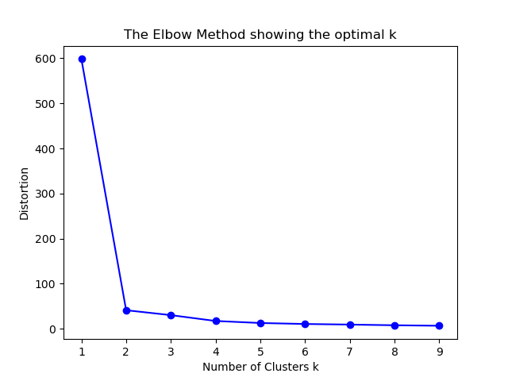
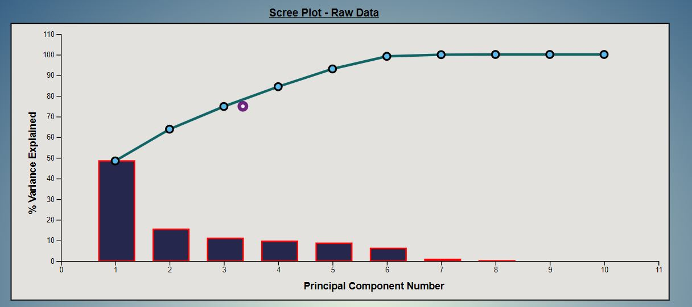

# Visual_Data_Analytics
Performing common visual data analytic tasks using Python and D3.js.

## Tools and Languages Used
- Languages:

     - Python v3 (for processing server)
     - HTML
     - CSS
     - Javascript

- Frameworks: 

     - d3.js (https://d3js.org/) (for client side)
     - Flask (https://pypi.org/project/Flask/)

## Data clustering
- Implemented Random Sampling and Stratified Sampling
- Performed K-means Clustering for Stratified Sampling using Elbow Method

## Dimension reduction
- Shows the bias introduced using the dimensionality reduction on both original and sampled data.
- Using PCA to find Intrinsic dimensionality of the data

### Scree plot visualization

- Raw Data

- Random Sampled Data

- Stratified Sampled Data

- Three attributes with highest PCA loadings

## 2D Scatter Plot Visualizations
- Using top two PCA vectors
- Using MDS (Euclidian & correlation distance)
- Scatterplot matrix of the three highest PCA loaded attributes
